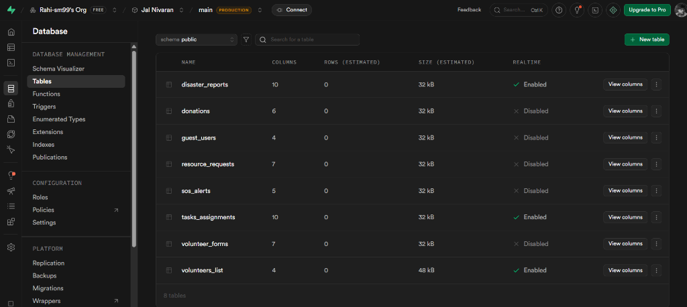

# Jal Nivaran (జల్ నివారణ)
### Water-logging Management & Response System - A Telangana Government Initiative

**Jal Nivaran** is a comprehensive, real-time platform designed to monitor, report, and manage water-logging and flood situations across Telangana. This project integrates IoT sensing, citizen reporting, and robust role-based administrative controls to provide an end-to-end disaster response solution.

---

## 🚀 Experience the Project

| Resource | Link |
| :--- | :--- |
| **Live Portal** | [jal-nivaran-telengana.vercel.app](https://jal-nivaran-telengana.vercel.app/) |
| **GitHub Repository** | [Rahi-sm99/JalNivaran-Telengana](https://github.com/Rahi-sm99/JalNivaran-Telengana) |
| **IoT Wokwi Simulation** | [Wokwi Smart Drainage Project](https://wokwi.com/projects/451569557993703425) |
| **IoT Dashboard** | [Smart Road & Accident Detection Website](https://smart-road-condition-accident-detec.vercel.app/) |
| **Presentation (PPT)** | [View Slides](https://docs.google.com/presentation/d/1X7rXsogsSgeoh2y_kM8YbetPKai7eoH-/edit?usp=sharing&ouid=117580346201569717291&rtpof=true&sd=true) |

---

## ✨ Key Features & Functionality

### 1. Unified Disaster Dashboard
*   **Real-time Alerts**: Live tracking of water levels and flood warnings across different zones (e.g., Hyderabad/Musi River).
*   **Interactive Maps**: Visual representation of water-logged hotspots using IoT sensor data.

### 2. Role-Based Access Control (RBAC)
*   **Admin Panel**: Restricted access for governmental officials (e.g., `spandanmondal15@gmail.com`) to manage the entire relief effort.
*   **Volunteer System**: Secure login for approved volunteers to view assignments and report status updates.
*   **Guest Access**: Allows citizens to "Continue as Guest" while still capturing essential contact details for tracking and safety.

### 3. Advanced Volunteer Management
*   **Approval Workflow**: Admins can review pending volunteer applications and approve/reject them. Approved volunteers are automatically granted system privileges.
*   **Task Assignment**: Direct allocation of relief tasks to available volunteers based on severity.

### 4. Citizen Reporting & Engagement
*   **Public Reporting**: Dedicated forms for citizens to report water-logging with image uploads and location tagging.
*   **Emergency Resources**: Quick access to contact numbers, shelter locations, and health resources.

### 5. IoT Integration
*   **Smart Sensing**: Simulated via Wokwi, using ESP32 and ultrasonic sensors to detect drain overflow and road conditions.
*   **Data Sync**: IoT data is piped into the main dashboard to provide predictive alerts before flooding becomes critical.

---

## 🛠️ Technical Stack

*   **Frontend**: Next.js 14, React, Tailwind CSS, Shadcn UI, Framer Motion.
*   **Backend & Auth**: Supabase (PostgreSQL, Auth, Storage), Google OAuth 2.0.
*   **IoT**: ESP32, Wokwi Simulator.
*   **Deployment**: Vercel.

---

## 🗄️ Database Architecture

Jal Nivaran relies on Supabase PostgreSQL for persistent data handling. The following tables structure our ecosystem covering real-time alerts, citizen reporting, user authentication, and SOS services:



---

## 🏛️ Project Motivation

Urban flooding is a growing challenge in rapidly developing states like Telangana. **Jal Nivaran** bridges the gap between technology and ground-level response. By combining IoT, official administration, and community volunteerism, we aim to minimize response time and ensure citizen safety during monsoons.

---

## 👷 Installation & Setup

1. **Clone the repo**:
   ```bash
   git clone https://github.com/Rahi-sm99/JalNivaran-Telengana.git
   ```
2. **Install dependencies**:
   ```bash
   npm install
   ```
3. **Setup Environment Variables**:
   Create a `.env.local` file with your Supabase credentials:
   ```env
   NEXT_PUBLIC_SUPABASE_URL=your_project_url
   NEXT_PUBLIC_SUPABASE_ANON_KEY=your_anon_key
   ```
4. **Run locally**:
   ```bash
   npm run dev
   ```

---
*Created with ❤️*
